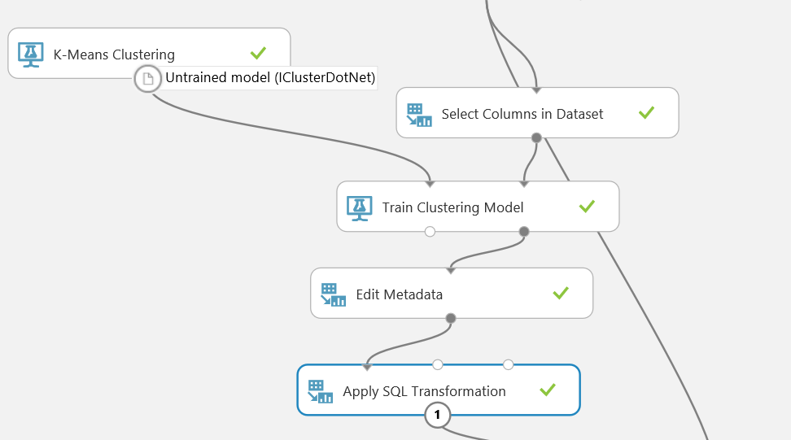
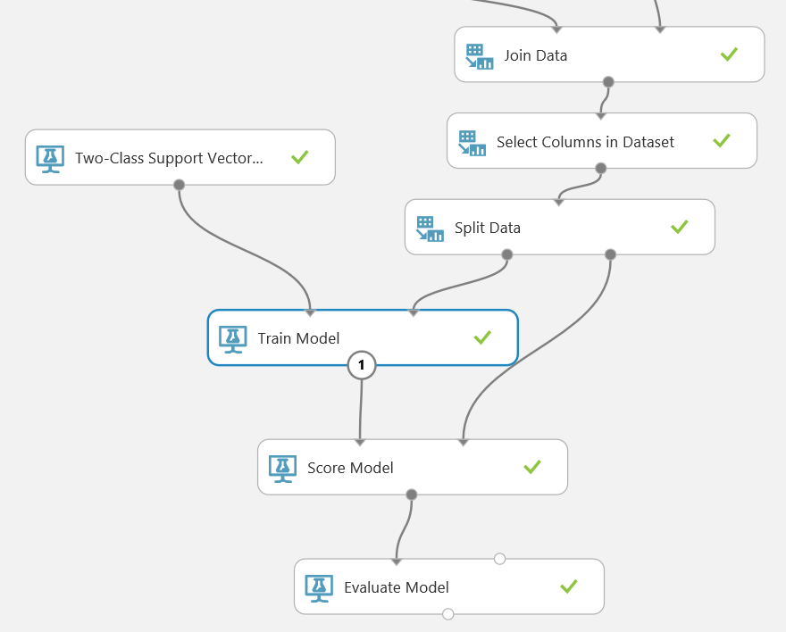
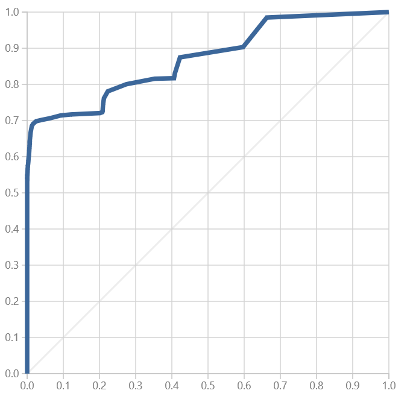

# Hands on Labs Global Azure Bootcamp 2017
## Vianen, April 22, 2017

## Azure Machine Learning

If needed create an Azure Machine Learning resource in the Azure Portal.
1. Press the '+' sign on the top left
2. Search for 'Machine Learning Workspace'
3. Create using default / own values
4. After the creating is finished open the blade to continue with the next steps
5. Click on the link 'Machine Learning Workspace' and sign in with the same credentials

Alternative you can navigate to https://studio.azureml.net and create a free account.

Once signed in you enter the Microsoft Azure Machine Learning Studio. On the left you see:
- *Projects*: Here you can define projects to bundle different 
- *Experiments*: This is the main workspace where all the machine learning takes part
- *Web Services*: An AzureML model can be exposed via a webservice and via that way used as part of a different solution
- *Notebooks*: A nootbook is an interactive enviroment () to experiment with data and models
- *Datasets*: What is machine learning without data: this is were all locally stored datasets can be managed
- *Trained Models*: An typical end result of a machine learning solution is a trained model. And that model can be used in a different experiment. This is the place where those models are managed.
- *Settings*: Of course you can alter some settings for Microsoft Azure Machine Learning Studio

### Introduction in Machine Learning

In our scenario we have +/- 1000 temperature and humidity sensors that generates messages. We want to determine if there our faulted measures/sensors and we suspect that the temperature measure is faulting. To test this hypothesis we need to follow as all Machine Learning projects these five steps:

1. Data selection.
2. Preprocessing.
3. Transformation.
4. Data Mining.
5. Interpretation and evaluation

Beware: it is an iterative process in which some, or all, steps may be repeated.

### 1. Data extract

At this moment AzureML is not capable in directly importing data from an Azure Data Lake Storage, so first download the output of the last excersise of the previous lab and save it to disk. And to import the data to Azure ML studio:

1. Click on '+ New' on the left bottom and select 'Dataset' -> 'From Local File'
2. Click on 'Browse' and navigate to the downloaded file
3. Enter a friendly name
4. Choose as 'Generic CSV File With no header (.nh.csv)'
5. Press the checkmark to start the upload of the file  

If you didn't finish the previous lab and/or you don't have a correct input file, follow the last portion of thye steps in the next paragraph.

### 2. Data selection

First step is getting the data into a new experiment.

1. Click on '+ New' on the left bottom and select 'Blank Experiment'
2. The default title is 'Experiment created on \<date>', but can easily changed to a logical name
3. The left toolbox has all the items that can be used in a experiment
4. Click in the search box and search for the name you provided
5. Select and drag the found dataset to the canvas

You can continue to the next paragraph as the next steps describes the steps if no own file is available.
If you didn't finish the previous lab and/or you don't have a correct input file, follow these steps:

6. Search for 'Import Data'
7. Drag the item to the canvas
8. Configure it with:
    - Data Source: Web URL with HTTP
    - Data Source URL: https://globalazurecis.blob.core.windows.net/adls/08.demo.out
    - Keep the rest default
9. Continue with the rest of the steps

### 3. Preparation

Now that we have imported a dataset we can examen it. Users that are using the import data items: click on the Play button to download the file.
1. Right click on the output of the item
2. In the context menu select 'Visualize'
3. A popup window is visible with some basic information of the data set:
    - On the top you see how many rows and column the dataset has
    - In the table the first 200 rows are visible
    - Just below the header of the table you see a graphical representation of the column data
    - If a column is selected basic statistical information is shown on the right. For numeric columns more statistical information is available.
4. In this view we can see that there are no column headers, so every column is called: 'col\<number>'

Now we are going to change the header so it easier to work with the data.

5. Search for the 'Edit Metadata' item
6. Connect the data output with th input of 'Edit Metadata' item
7. Click on the 'Launch column selector' to lanch the column selector window
8. In this window you can select column in different ways:
    - By Name: this option is only available if the item has runned (little green checkmark to the right of the text) and the columnnames are known
    - With Rules: with this option you can create in different ways a column selection. First slection is the starting rule: with or without column, so if we are excluding or including columns. After that we can add extra rules to either include or exclude columns by varios rules.
9. Here we are using the 'With rules' option and we start with all columns as we want to rename all column names
10. After closing the column selector window paste the following comma seperated string in the 'New column names' textbox
    `time,dsplid,dspl,temp,hmdt,status,building,floor,EventProcessedUtcTime,PartitionId,EventEnqueuedUtcTime`
11. Run the experiment and take a look al the 'Visualize' windowto validate that the column names are changed

### 4. Transformation
The operational department has mentioned that there are sensors messages that are not valid and should be ignored. And the way to identify them: there 'status' column is 'O.' So we are going to filter the data

1. Search for the 'Split Data' item
2. As mode select 'Regular Expression'
3. Use `\"status" ^OK` as expression
4. Run the experiment and validate that there are only status 'OK' in the 1st output

Before we start with the next part we need to validate if the hypothesis is valid, so we are taking a closer look to the data

5. Search for the 'Apply SQL Transformation'
6. Connect the 1st output of the 'Split Data' to the 1st input
7. Paste the following SQL query in the 'SQL Query Script'
```
select distinct
    temp,
    count(*) cnt
from t1;
```
8. Run the experiment and validate that our hypothesis is valid
9. For the next phase we can delete this item

Next step is to automaticly identify faulted sensors via a clustering algoritm:

10. First select only the `dsplid` and `temp` values with the 'Select Columns in Dataset' item from the dataset (output 'Split Data')
11. Add a 'K-Means Clustering' item to the canvas and as it only has an output it cannot be connected to another output
12. Add a Random Seed of 1234 to the 'K-Means Clustering' item
13. Add a 'Train Clustering Model' and connect both the 'K-Means Clustering' and the 'Select Columns in Dataset' to the correct inputs
14. Select `temp` as the values to be used for the clustering algoritm
15. Add an 'Edit Metadata' and connect it to the output of the 'Train Clustering Model' item
16. Select `Assignments` as input column and use 'Make Categorial' as option for 'Categorial' option
17. Add an 'Apply SQL Transformation' and use the following query to output a list of faulted (1) sensors
```
select
    dsplid,
    max(Assignments) Assignments
from t1
group by dsplid;
```
18. Run the experiment and validate if there are any sensors that are faulted



### 5. Data Mining
Now that we have out data prepared and in the correct format we can start with the data mining part.  
We are using a classification algoritm: Two-Class Support Vector (SVM)

The first step we need to do is to join the 'faulted sensor' dataset with the original prepared dataset
1. Seach and drag a 'Join Data' item to the canvas
2. Connect the 'faulted sensor' dataset from the 'Apply SQL Transformation' to the left of the 'Join Data' item
3. And the right dataset is connected from the 'Split Data' that 's filters the data
4. Make sure that the key columns for the L and R part are the same: 'dspid'
5. Run the experiment and validate if the dataset contains the same columns as the original dataset and the 'Assignments' column

After joining the data select only the columns of the original data and the 'Assignments' column of the 'faulted sensor' dataset with a 'Select Columns in Dataset'
Next step is the creating of a trainings set and a test set for the Two-Class Support Vector alogoritm.

6. Use the 'Split Data' item to split the data equal (0.5) with a random seed of e.g. 1234
7. Drag a 'Two-Class Support Vector' item to the canvas and
8. Connect it to a 'Train Model' and use the left part of the 'Split Data' as input for the trainingsset
9. Be sure that the 'Assignments' is thew labeled column as we want the model to predict that label
10. To test out model we use a 'Score Model' item to test the model output and the trainingsset output
11. Run the experiment to validate that the scoring model is working and validate if the predicted labels are as we expected



### 6. Interpretation and evaluation
The last step we are going to do is the evaluation of the calculated model.
With an 'Evaluate Model' item we can test the input and look at the evaluation graph and see if it is 



### 7. Refinement
Now that we have a basic model we can refine the model and try to predict the faulted label better. Try to alter some parameters of the SVM model and see if you can create a better scoring model. 

You can create a second scoring stream by adding 'Two-Class Support Vector', 'Train Model' and 'Score Model' items to the canvas and use that outcome as the right input of the 'Evaluate Model' item to compare both models and easily see which one scores better.

---
[Back](../README.md) | [License](../LICENSE)